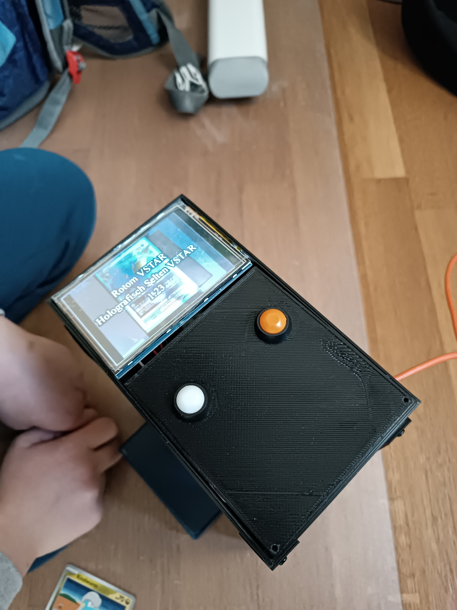

# pokemon-card-detector
A simple python app that classifies pokemon cards in real-time. Pokemon data is loaded via tcgdexsdk (thanks for hosting!).
It furthermore provides a model to check if a card is a fake copy or not - based on the card's back site.

## Quick start
- call pip install -r requirements.txt
- call query_card_webcam.py to classify cards in real-time via your webcam (card must fill the rectangle in the middle)
- call query_card.py to classify a photo
- call query_card_raspi.py to run on a raspberry pi

### How to re-create indices (normally not required, indices come with the repo (created november 2025))
- Data is gathered via download_data.py. This script downloads images and json meta-data to a "data" directory
- Merge the data into a single json file via merge_json.py
- Call build_index.py to create numpy arrays with emeddings and labels
- Call create_faiss_index.py to create the FAISS index
- You can now delete the data folder

## Install on raspberry pi
- export DISPLAY=:0.0
- sudo apt install python3-picamera2
- python3 -m venv pokemon --system-site-packages
- source pokemon/bin/activate
- pip install git+https://github.com/openai/CLIP.git

### Parts required
- Raspberry pi (tested with v5)
- Raspberry pi 3,5" display shield (e.g. https://www.reichelt.de/de/de/shop/produkt/raspberry_pi_shield_-_display_lcd-touch_3_5_480x320_pixel_xp-202827?PROVID=2788)
- RASP CAM 3 W (wide angle camera) (e.g. https://www.reichelt.de/de/de/shop/produkt/raspberry_pi_-_kamera_12mp_120_v3-339260)
- 2 Push Buttons (https://www.roboter-bausatz.de/p/12mm-drucktaster-sortiment-7-farben)
